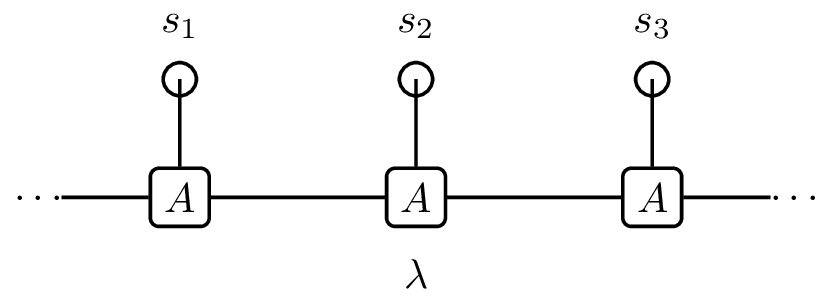
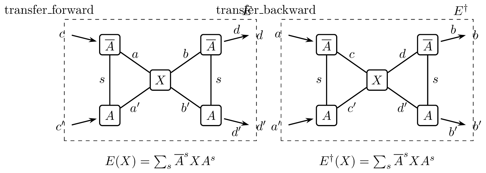

# 速记笔记（RP^n · 量子几何 · 黎曼优化）

## TL;DR

- RP^n：齐次坐标与仿射图册最实用；球面对顶粘合直观；数值上优先“最大坐标选图”。
- QGT：实部 g_ij 衡量相邻态可区分性，虚部 F_ij 为贝里曲率；局部性与规范不变性是核心。
- 度规作用于切空间；df 与 grad 由度规建立对偶：df(ξ)=⟨grad f, ξ⟩。
- 黎曼 Newton：在切空间解线性方程，retraction 回到流形；结合线搜索/信赖域更稳健。

---

## Zygote · pullback/gradient · Wirtinger 速记

### 1. `pullback` 是什么？与 `gradient` 的关系

- 调用：`y, back = Zygote.pullback(f, xs...)` 得到反向传播算子 `back`（VJP）。对任意与 `y` 同型的“种子” `ȳ` 有 `back(ȳ) = (∂ℓ/∂x₁, ∂ℓ/∂x₂, …)`，其中 `ℓ = Re(conj(ȳ) * y)`。
- `gradient` 只是 `pullback` 的便利封装（标量输出时）：
  ```julia
  _, back = Zygote.pullback(f, xs...)
  grads = back(1)   # 1 与 y 同型的单位种子
  ```

### 2. 复数输出时：`back(1)` 和 `back(im)`

设 `f :: ℂ → ℂ`，输入 `x0`：

- `back(1)[1] == gradient(x -> real(f(x)), x0)[1]`（实部梯度）。
- `back(im)[1] == gradient(x -> imag(f(x)), x0)[1]`（虚部梯度）。
- 统一公式：
  \[
  \boxed{\ \texttt{back(}\alpha\texttt{)[1]} = \nabla_x \operatorname{Re}\!\big(\overline{\alpha}\,f(x)\big)\ }
  \]
  取 `α=1` 得实部，`α=im` 得虚部。

### 3. 为什么会出现共轭？

- Zygote 采用实内积 \(\langle u,v\rangle = \operatorname{Re}(u^* v)\)，VJP 计算的是微分的伴随 \(A^\dagger ȳ\)。
- 对 `f(x) = x^2`，微分为 `δf = 2x₀ δx`，所以 `back(1)[1] = conj(2x₀)`.

### 4. 与 Wirtinger 导数的对应

记
```julia
du = back(1)[1]     # ∇ₓ Re f
dv = back(im)[1]    # ∇ₓ Im f
```
则
\[
\boxed{
\frac{\partial f}{\partial z}   = \frac{\overline{du} + i\,\overline{dv}}{2},\qquad
\frac{\partial f}{\partial \bar z} = \frac{du + i\,dv}{2}
}
\]
换言之，对任意实标量 `L(x)`，Zygote 的“梯度”满足 \(\nabla_x L = 2\,\partial L / \partial \bar x\)，而 \(\partial L / \partial x = \tfrac12 \overline{\nabla_x L}\)。

### 5. 典型对比：`x^2` vs `conj(x)^2`

- `f₁(x) = x^2`：`back(1)[1] = 2*conj(x0)`，`back(im)[1] = 2im*conj(x0)`，因此 \(\partial f₁ / \partial z = 2x₀\)，\(\partial f₁ / \partial \bar z = 0\)（全纯）。
- `f₂(x) = conj(x)^2`：`back(1)[1]` 同上（因为 `Re(x^2) == Re((conj x)^2)`），但 `back(im)[1]` 号相反；对应 \(\partial f₂ / \partial z = 0\)，\(\partial f₂ / \partial \bar z = 2\overline{x₀}\)。

### 6. `back(1)[1]` 对应 \(\partial/\partial \bar x\)

- 更精确地：
  \[
  \texttt{back(}\alpha\texttt{)[1]} = 2\,\frac{\partial}{\partial \bar x} \operatorname{Re}(\overline{\alpha} f(x)),\qquad
  \frac{\partial}{\partial x} \operatorname{Re}(\overline{\alpha} f) = \tfrac12 \overline{\texttt{back(}\alpha\texttt{)[1]}}.
  \]

### 7. Julia 代码模板

**单个复参数：返回 \((\partial f/\partial z,\, \partial f/\partial \bar z)\)**

```julia
using Zygote

function wirtinger(f, z0::Complex)
    y, back = Zygote.pullback(f, z0)
    du, dv  = back(1)[1], back(im)[1]
    dfdz    = (conj(du) + im * conj(dv)) / 2
    dfdzbar = (du + im * dv) / 2
    return dfdz, dfdzbar
end
```

**多参数 / 向量参数**

```julia
function wirtinger_arg(f, args...; idx::Int = 1)
    y, back = Zygote.pullback(f, args...)
    du, dv  = back(1)[idx], back(im)[idx]
    dfdz    = (conj.(du) .+ im .* conj.(dv)) ./ 2
    dfdzbar = (du .+ im .* dv) ./ 2
    return dfdz, dfdzbar
end
```

### 8. 对应常见问题

- `pullback` 和 `gradient` 算法是否一样？——一样：`gradient == pullback + back(1)`。
- `back(1)[1]` / `back(im)[1]` 是否等价于 `gradient(real/imag)`？——完全一致。
- 为什么 `x -> x^2` 有 `back(1)[1] = 2*conj(x0)`？——VJP 是微分的伴随，复数下伴随包含共轭。
- `x -> x^2` 与 `x -> conj(x)^2` 的 `back(1)[1]` 为什么一样？——因为它们的实部一致；但 `back(im)[1]` 符号相反。
- `back(·)[1]` 对应 \(\partial/\partial x\) 还是 \(\partial/\partial \bar x\)？——对应 \(2\,\partial/\partial \bar x\)，要 \(\partial/\partial x\) 则取其共轭再除以 2。

---

## 1. 射影空间 RP^n

### 1.1 定义与基本性质

- 定义（齐次坐标）：
  \[
  \mathbb{RP}^n = (\mathbb{R}^{n+1}\setminus\{0\})/\sim,\quad x\sim\lambda x\ (\lambda\neq 0),
  \]
  等价类记作 \([x_0:\dots:x_n]\)。
- 维度：\(\dim \mathbb{RP}^n = n\)。
  直观理由：用 \(n+1\) 张仿射图 \(U_i\) 覆盖，每张与 \(\mathbb{R}^n\) 微分同胚；或视为商 \(S^n/{(x\sim -x)}\)。
- 切空间：\(T_{[x]}\mathbb{RP}^n \cong x^\perp/\mathrm{span}(x)\)。
- 对比：复射影空间 \(\mathbb{CP}^n\) 的复维数为 \(n\)，实维数为 \(2n\)。

### 1.2 坐标与图册

- 仿射图册（最标准）：
  - 开集：\(U_i=\{[x]\in \mathbb{RP}^n: x_i\neq 0\}\)。
  - 图坐标（非齐次）：
    \[
    \phi_i:U_i\to\mathbb{R}^n,\quad [x_0:\dots:x_n]\mapsto\Big(\tfrac{x_0}{x_i},\dots,\widehat{\tfrac{x_i}{x_i}},\dots,\tfrac{x_n}{x_i}\Big).
    \]
  - 过渡函数在 \(U_i\cap U_j\) 上有理/光滑。
- 球面视角（对顶点识别）：商映射 \(\pi:S^n\to\mathbb{RP}^n\), \(\pi(x)=\pi(-x)\)。半球参数化后经 \(\pi\) 得局部坐标；适合可视化（尤其 \(\mathbb{RP}^2\)）。
- 代表元规范化（选择规约）：如 \(|x|=1\) 且“最后一个非零坐标为正”，或在某张 \(U_i\) 中设 \(x_i=1\)。常用于数值/优化。
- 数值稳定建议：给定 \([x]\)，选 \(i=\arg\max_k|x_k|\) 再用 \(\phi_i\)，避免除以很小的数。

### 1.3 细胞分解与低维例子

- CW 分解：每维一个细胞，典型参数化 \(D^k\ni(t_1,\dots,t_k)\mapsto [t_1:\dots:t_k:1:0:\dots:0]\)。
- 低维例子：
  - \(n=1\)：两张图 \(U_0,U_1\)，重叠处 \(s=1/t\)；\(\mathbb{RP}^1\cong S^1\)（\(\theta\sim\theta+\pi\)）。
  - \(n=2\)：三张图；球面视角为对顶粘合；每张图同胚 \(\mathbb{R}^2\)。

### 1.4 何时用哪种表达与数值建议

- 微分/代数几何推导：优先仿射图册。
- 几何直观与绘图：用球面对顶识别。
- 数值与优化：最大坐标选图或单位范数+符号规范。

---

## 2. 量子几何与量子几何张量（QGT）

### 2.1 参数空间与量子态的角色

- 参数空间 \(A\)：以 \(\lambda=(\lambda_1,\dots,\lambda_n)\) 为坐标的 \(n\) 维（通常有限维）流形；连续但维度是“坐标个数”。
- 量子态 \(|u(\lambda)\rangle\)：希尔伯特空间向量；物理态是射线（相位等价），所有几何量需规范不变。
- 非线性依赖：一般 \(\psi(A_1+A_2)\neq\psi(A_1)+\psi(A_2)\)。

### 2.2 几何距离与无穷小形式

- 相邻物理态距离（保真度）：\(s^2_{12}=1-|\langle u_1|u_2\rangle|^2\)（规范不变）。
- 无穷小距离：两个无限接近态 \(|u(\lambda)\rangle, |u(\lambda+d\lambda)\rangle\) 之间
  \[ds^2 = \sum_{i,j} g_{ij}(\lambda)\, d\lambda^i d\lambda^j.\]

### 2.3 QGT 的定义与分解

- 纯态/单带：
  \[G_{ij}(\lambda)=\langle\partial_i u|\partial_j u\rangle - a_i(\lambda)\,a_j(\lambda),\quad a_i=i\langle u|\partial_i u\rangle.\]
  实部为度规 \(g_{ij}=\tfrac{1}{2}(G_{ij}+G_{ij}^\dagger)=\operatorname{Re}G_{ij}\)，虚部给出贝里曲率 \(F_{ij}=i(G_{ij}-G_{ij}^\dagger)\)。
- 多带/非阿贝尔推广：
  \[G_{nm,\mu\nu}(\mathbf k)=\langle\partial_\mu u_{n,\mathbf k}|(1-\hat P)|\partial_\nu u_{m,\mathbf k}\rangle,\ \ \hat P=\sum_l |u_l\rangle\langle u_l|.\]

### 2.4 几何/物理要点（局部性、规范不变性、可区分性）

- 局部性：\(g_{ij}(\lambda)\) 是参数流形上的张量场，随 \(\lambda\) 位置变化。
- 规范不变：由保真度/投影去相位项确保；与相位选择无关。
- 可区分性与涨落：\(g\) 越大表示波函数随参数变化越快；原子绝缘体近零、带反转区域与临界（如狄拉克点）处可显著增大或发散。

### 2.5 维度与自由度澄清

- 局部矩阵阶：在 \(n\) 维参数流形上一点，\(g_{ij}\) 是 \(n\times n\) 对称矩阵（独立分量 \(n(n+1)/2\)）；\(F_{ij}\) 反对称（独立分量 \(n(n-1)/2\)）。QGT 合计 \(n^2\) 个独立分量。
- 张量场的“全局描述”：可视为“\(n^2\) 个分量函数”，每个都是 \(n\) 个坐标的标量函数 \(g_{ij}(\lambda)\)。

### 2.6 张量网络变分流形（uMPS/uPEPS）：主丛与 FS 拉回度量

- 总空间与规范群：
  - 定义 \(E\)：所有可行的局部张量集合（uMPS 的 \(\{A^s\}\) 或 uPEPS 的 \(\{A^{s}_{u d l r}\}\)）。
  - 规范群 \(G\)（虚键可逆矩阵的直积）与整体复数缩放 \(\mathbb C^\times\) 在 \(E\) 上作用：
    - MPS：\(A^s \mapsto X^{-1} A^s X\)
    - PEPS：\(A \mapsto (X_u^{-1},X_d^{-1},X_l^{-1},X_r^{-1})\) 逐腿共轭
  - 物理等价类：物理变分流形为商空间 \(\mathcal M = E/(G\times \mathbb C^\times)\)。

- 主丛与坐标：
  - \(\pi:E\to\mathcal M\) 是主丛投影；选择规范（如 MPS 左/右规范，PEPS 的 isometric/gauge fixing）等于选取局部截面。
  - 选好规范后，\(A\) 的分量成为 \(\mathcal M\) 的局部坐标（规范冗余已剔除）。

- 射影希尔伯特空间与浸入：
  - 物理希尔伯特空间 \(\mathcal H\)，射影空间 \(\mathbb P(\mathcal H)\)。
  - 定义 \(\Phi: \mathcal M \to \mathbb P(\mathcal H)\), \([A] \mapsto [\psi(A)]\)；在已规范/归一化坐标下写作 \(A \mapsto \psi(A)/\|\psi(A)\|\)。

- Fubini–Study 度量的拉回：
  - 用 \(\Phi\) 将 \(\mathbb P(\mathcal H)\) 的 FS 度量拉回到 \(\mathcal M\)，得到自然度量：
    \[
    g_A(B,C) = \mathrm{Re}\Big(\langle \partial_B\psi\mid \partial_C\psi\rangle - \langle \partial_B\psi\mid \psi\rangle\,\langle \psi\mid \partial_C\psi\rangle\Big),
    \]
    其中 \(|\partial_B\psi\rangle\) 是映射 \(A\mapsto\psi(A)\) 的微分对方向 \(B\) 的推前。

- 切空间的垂直/水平分解：
  - 垂直（vertical）= 规范方向（零模），在 \(\mathcal M\) 上被商掉：
    - MPS：\(B^s = A^s X - X A^s\)
    - PEPS：各腿类似的 \(X_u,X_d,X_l,X_r\) 生成方向
  - 水平（horizontal）= 选定规范后的合法扰动：
    - 例如 MPS 左规范条件 \(\sum_s A^{s\dagger}B^s=0\)；PEPS 的等距约束
    - 水平分量经 \(\mathrm d\Phi\) 映到 \(\mathbb P(\mathcal H)\) 的切空间（再做 FS 正交投影）。

- 几何结构一览：
  \[
  \boxed{\ A\in E\ \xrightarrow{\ \pi\ }\ [A]\in \mathcal M = E/(G\times\mathbb C^\times)\ \xrightarrow{\ \Phi\ }\ [\psi]\in \mathbb P(\mathcal H)\ }\,.
  \]
  - \(A\)：总空间 \(E\) 的代表（含规范自由度）
  - \([A]\)：物理变分流形 \(\mathcal M\) 的点（去除规范与相位/归一化）
  - \([\psi]\)：射影希尔伯特空间上的点
  - \(\Phi^* g_{\mathrm{FS}}\)：FS 度量拉回到 \(\mathcal M\)，给出以 \(A\)-坐标使用的自然度量

- 小结：\(A\) 是变分流形的坐标（主丛代表），\(\psi(A)\) 是 \(\mathbb P(\mathcal H)\) 的点；优化中的“自然梯度/度量”正是 \(\Phi^* g_{\mathrm{FS}}\)。

---

## 3. 切空间、1-形式与梯度（对偶性）

### 3.1 切向量定义

- 几何学定义：流形曲线 \(\phi(t)\) 在 \(t=0\) 的速度等价类；在点 \(x\) 的切空间 \(T_xM\) 元素。
- 坐标表示：在局部坐标 \(q^i\) 下，\(\xi=\xi^i\,\partial/\partial q^i\)。

### 3.2 1-形式与梯度的对偶

- 1-形式：\(\mathrm df=\sum_i (\partial f/\partial q^i)\,\mathrm dq^i\in T^*_xM\)。
- 度规诱导同构：\(\mathrm df(\xi)=\langle\operatorname{grad} f,\xi\rangle_g\)。度规把 1-形式“抬起”为向量（梯度）。
- “度规作用对象”：度规是切空间上的内积，作用于切向量（或其坐标分量 \(d\lambda\)）。

---

## 4. 黎曼牛顿法（Riemannian Newton）

### 4.1 设定

- 流形：\((\mathcal M, g)\) 为带黎曼度量的可微流形。
- 目标：\(f:\mathcal M\to\mathbb R\) 二阶可微。
- 梯度：\(\operatorname{grad} f(x)\in T_x\mathcal M\) 满足 \(g_x(\operatorname{grad} f(x),\xi)=\mathrm df(x)[\xi]\)。
- Hessian（协变 Hessian）：\(\operatorname{Hess} f(x)[\xi]=\nabla_\xi \operatorname{grad} f\)，\(\nabla\) 为 Levi–Civita 连接。

### 4.2 牛顿步与回到流形

- 牛顿方向：在 \(T_{x_k}\mathcal M\) 解 \(\operatorname{Hess} f(x_k)[\eta_k]= -\operatorname{grad} f(x_k)\)。
- 更新：\(x_{k+1}=R_{x_k}(\alpha_k\eta_k)\)，\(R\) 为指数映射或 retraction；\(\alpha_k=1\) 或配合线搜索/信赖域。

### 4.3 收敛与数值稳定

- 非退化极小点附近配合 \(\exp\) 或合格的 retraction：局部二次收敛。
- 阻尼牛顿/信赖域：全局收敛与近解区二次/超线性；Hessian 不定时可加 \(\lambda I\) 正则。

### 4.4 嵌入子流形实现要点

- Riemannian 梯度：\(\operatorname{grad} f(x)=\Pi_x(\nabla \bar f(x))\)，\(\Pi_x\) 为到 \(T_x\mathcal M\) 的正交投影，\(\bar f\) 为任一光滑延拓。
- Riemannian Hessian：
  \[\operatorname{Hess} f(x)[\xi]=\Pi_x\big(\nabla^2\bar f(x)[\xi]\big)+\mathcal A_x(\xi,\nabla \bar f(x)),\]
  其中二基本形式/Weingarten 项 \(\mathcal A\) 由曲率引入；近最优点 \(\nabla\bar f(x)\) 小，可用 \(\Pi_x\nabla^2\bar f\Pi_x\) 近似。

### 4.5 典型流形与实战建议

- 单位球面 \(\mathbb S^{n-1}\)（嵌入 \(\mathbb R^n\)）：\(\Pi_x=I-xx^\top\)；常用 retraction：\(R_x(\eta)=\frac{x+\eta}{\|x+\eta\|}\)。
- SPD 流形 \(\mathcal S_{++}^n\)：Affine-invariant 度量 \(g_X(\Xi,\Eta)=\operatorname{Tr}(X^{-1}\Xi X^{-1}\Eta)\)，\(\exp_X(\Eta)=X^{1/2}\exp(X^{-1/2}\Eta X^{-1/2})X^{1/2}\)。
- 实战：优先用便宜的 retraction；远离极值配合 Wolfe/Armijo 回溯；Hessian 近奇异时用阻尼/信赖域；需要跨点比较向量时用与 \(R\) 相容的向量传输。

---

## 5. 附录

### 5.1 统一记号（本笔记约定）

- 参数空间与坐标：\(\lambda\in A\subset\mathbb R^n\)，切向量的坐标分量记 \(d\lambda\)。
- 量子态：\(|u(\lambda)\rangle\) 归一化；Berry 连接 \(a_i=i\langle u|\partial_i u\rangle\)。
- QGT：\(G_{ij}\)；度规 \(g_{ij}=\operatorname{Re}G_{ij}\)；曲率 \(F_{ij}=i(G_{ij}-G_{ij}^\dagger)\)。

### 5.2 常用公式小抄

- 无穷小距离：\(ds^2=g_{ij} d\lambda^i d\lambda^j\)。
- 投影去相位项：\(G_{ij}=\langle\partial_i u|\partial_j u\rangle-a_i a_j\)。
- 多带投影：\(\hat P=\sum_l |u_l\rangle\langle u_l|\)，\(G_{nm,\mu\nu}=\langle\partial_\mu u_n|(1-\hat P)|\partial_\nu u_m\rangle\)。
- 球面 retraction：\(R_x(\eta)=\frac{x+\eta}{\|x+\eta\|}\)。
- SPD 指数映射：\(\exp_X(\Eta)=X^{1/2}\exp(X^{-1/2}\Eta X^{-1/2})X^{1/2}\)。

### 5.3 常见误区（对齐澄清点）

- 维度 vs 连续性：空间可连续但维度是坐标个数（有限）。
- 矩阵阶 vs 张量场：一点处矩阵是 \(n\times n\)；“全局”是 \(n^2\) 个分量函数各自依赖 \(n\) 个变量，不应误记为“\(n^3\) 个函数”。
- 度规作用对象：度规在切空间上定义内积，不直接作用于“位置向量”。

---

## 6. 实战：uMPS 基态项目（TensorKit + OptimKit）

本节给出用 TensorKit + OptimKit 实现 uniform MPS（uMPS）最小化能量密度的工程化方案。与 2.6 的几何图一致：在主丛坐标 A 上做优化，并用 Fubini–Study（FS）度量的拉回定义自然梯度与投影。

### 6.1 依赖与初始化（Julia）

- 依赖包（推荐）：TensorKit、TensorOperations、KrylovKit、OptimKit、LinearAlgebra、Printf。
- Pkg 操作：
  ```julia
  using Pkg
  Pkg.add(["TensorKit","TensorOperations","KrylovKit","OptimKit"])
  ```
  说明：KrylovKit 用于转移算符的特征/线性方程；OptimKit 用于リ流形优化框架。

### 6.2 uMPS 状态与规范

- 物理维 `d`，键维 `D`。令物理空间 `p = ComplexSpace(d)`，虚空间 `v = ComplexSpace(D)`。
- 选 A 的类型为 `TensorMap(v ← v ⊗ p)`（约定“←”表示 codomain ← domain）。
- 建议使用左规范（left-canonical）：`∑_s A^{s†} A^s = I`，其好处：
  - FS 度量在此规范下与 `B` 的 Frobenius 内积一致；
  - 水平投影公式简单（见 6.4）。

### 6.3 能量密度 e(A) 的计算（最近邻哈密顿量）

设两体局域项 `h₂` 作用于 `p ⊗ p`，目标是能量密度
\[ e(A) = \frac{\langle\psi(A)| H |\psi(A)\rangle}{N}. \]

实现步骤（无限链）：
1) 计算转移算符 `E(X) = ∑_s A^s X A^{s†}` 的主特征对：`E(r)=r`、`E†(l)=l`，并归一化 `tr(l r)=1`。可用 `KrylovKit.eigsolve`（非厄米）。
2) 计算两体期望：把 `h₂` 插到相邻两站，中间用 `r` 和 `l` 作为环境收敛；得到 `⟨h₂⟩`。
3) e(A)=⟨h₂⟩（对平移不变最近邻，能量密度即单键贡献）。

注：若使用 MPO 形式，也可先压缩到两体有效算符再做第 2 步；核心依旧是求 `l,r` 环境并做一次局域收缩。

### 6.4 自然梯度（FS）与水平投影

- FS 拉回度量在左规范下：`⟨B,C⟩ = Re ∑_s tr(B^{s†} C^s)`。
- 约束（水平子空间）：`∑_s A^{s†} B^s = 0`。
- 对任意“欧氏”梯度 `G`，其到水平子空间的投影（左规范）为：
  \[
  P_\mathrm{hor}(G) = G - A\,C,\quad C = \sum_s A^{s\dagger} G^s.\]
  这样 `∑_s A^{s†} P_h(G)^s = 0` 自动成立。

能量函数的方向导数为 `δe = 2 Re ⟨∂_B ψ | (H - e) | ψ⟩/N`；实现上可通过构造“插入 `∂A`”的有效环境，并解一次 `(I−E)† y = v` 的线性方程（去掉规范零模）得到 `G`，再做水平投影 `P_h(G)`。

### 6.5 重traction（Retraction）与归一化

- 简单且有效的选择：左规范 retraction。
  1) 令 `Ã = A + η`（切向量步长）。
  2) 将 `Ã` 沿 `(v⊗p)→v` 视作矩阵做极分解/QR：`M = reshape(Ã, D*d, D)`，`Q,R = qr(M)`；
  3) 用 `Q` 回填成 `A_new` 对应的 `TensorMap(v ← v ⊗ p)`，确保 `∑_s A_new^{s†} A_new^s = I`。
- 该 retraction 一阶与指数映射一致，足以配合 OptimKit 的共轭梯度/LBFGS。

### 6.6 OptimKit 接口（示例签名）

定义以下回调（伪代码风格，体现接口形状）：
```julia
"""能量密度"""
cost(A) = energy_density(A, h2)  # 用 6.3 的 l,r 与两体收缩

"""欧氏梯度 → 水平投影后的自然梯度"""
function grad!(G, A)
    G_euclid = energy_grad_euclid(A, h2, l, r)  # 环境+线性方程
    G[:] = proj_horizontal(A, G_euclid)         # 用 6.4 的 P_h
end

"""FS 内积（左规范下为 Frobenius）"""
inner(A, X, Y) = real(sum(conj.(X) .* Y))

"""重traction：左规范化"""
retract(A, η, α) = left_retract(A, α*η)  # 见 6.5

"""（可选）向量传输：恒等或“再投影到水平”"""
transport(A, Anew, η) = proj_horizontal(Anew, η)

"""调用 OptimKit（以 LBFGS 为例）"""
method = OptimKit.LBFGS()
x_opt, fx, info = OptimKit.optimize(cost, grad!, retract, inner, A0;
    transport=transport, maxiter=200, g_tol=1e-8)
```

备注：`energy_grad_euclid` 的标准做法是构造“(H−e)” 的两体插入图并累积到无穷远，计算量通过求解 `(I−E)† y=v` 控制；需在零模子空间正交补上解（例如减去 `|ψ⟩` 分量）。

### 6.7 示例：横场 Ising (TFIM)

- 局域哈密顿量：`h₂ = −J σᶻ⊗σᶻ − g (σˣ⊗I + I⊗σˣ)/2`。
- 物理空间：`p = ComplexSpace(2)`；键维 `D` 可从 4/8 起步。
- 初始化：随机 `A` → 左规范化；然后用上面的 OptimKit 接口最小化 `e(A)`。

完成这一步后，可加入：
- 二体更远相互作用（可先展开成有限个局域项再逐项累加能量）；
- 对称性（Z₂/U(1)）用 TensorKit 空间直和与块结构；
- 预条件（近似 `(I−E)` 的逆）提升收敛。

【项目脚手架】已在 `uniform_mps/` 下创建最小骨架（模块+示例）：
- 入口：`uniform_mps/src/UniformMPS.jl`
- 示例：`uniform_mps/examples/s1_heisenberg.jl`
- 运行：`julia uniform_mps/examples/s1_heisenberg.jl`
- 说明：见 `uniform_mps/README.md`

## MPS 图示（TikZ 模板）

在笔记里放一个最小的 TikZ 片段，复用时把它嵌进 `\begin{tikzpicture}` 环境即可：



**用法提示：**
- 源 TikZ 模板在 `mps_diagram.tex`，可修改后用 `pdflatex` 重新生成。
- `tensor` 样式控制 MPS 张量节点外观，可根据需要调整。
- 虚拟腿（水平连线）象征 bond 维度，左右用省略号延伸成无限链。
- `phys` 样式让物理腿用小圆点表示，可在圆点旁标记物理索引 `s_1, s_2, s_3`。
- 若要加入环境 `l, r` 或插入算符，可在 TikZ 源里额外放置节点连线后重新导出图片。

## 转移算符示意图



**说明：**
- 上半图对应 `transfer_forward(A, Aconj, X)`，即向右作用的转移算符 \(E(X)=\sum_s \overline{A}^s X A^s\)。
- 下半图对应 `transfer_backward(A, Aconj, X)`，表示伴随算符 \(E^{\dagger}(X)=\sum_s \overline{A}^s X A^s\)。
- 如需调整节点或标注，可修改 `transfer_diagram.tex` 后重新编译并转换图片。

> 当前实现仅使用局域两站点哈密顿量 + 环境收缩计算能量，不再构造 MPO；若将来需要长程或多体项，可单独展开成有限和或另写专用流程。

---

## `proj_gauge` 笔记（uMPS / TensorKit + KrylovKit）

把规范投影（去掉纯规范与射线分量）的目标、定义、实现与验证系统整理如下，方便日后复用。

### 目的（What & Why）

给定均匀 MPS 的局域张量 `A` 与一个方向/梯度 `B`（代码中常为 `G`），希望得到物理水平向量
`B_hor ∈ H_A`，满足：

- **去纯规范**：`B_hor ⟂ Im M`，其中 `M(Z) = [A, Z]`；
- **去射线**：`⟨A, B_hor⟩_bond = 0`，即沿 `|ψ⟩` 的幅度/相位方向被剔除；
- **度规**：使用由 `rdm` 给出的 bond/Fubini–Study 近似保持几何一致性。

收益：线搜索更稳、收敛更快；保持对称性简并；为自然梯度/信赖域提供干净水平向量。

### 数学表述（bond/FS 口径）

记 `⟨X, Y⟩_bond = ∑_s Tr(X^{s†} l · Y^s r)`，其中 `rdm[a,c;b,d] = r[a;b] l[c;d] / λ`。

1. **去纯规范**：求解正规方程（SPD）
   ```
   (M†_bond M + ε I) Z = M†_bond B
   ```
   其中 `ε ∈ [1e-6, 1e-4]` 用于抬零模，得到 `Z*`。
2. **纯规范投影**：`B' = B - [A, Z*]`。
3. **去射线**：`B_hor = B' - s A`，其中 `s = ⟨A, B'⟩_bond`。

（若 `rdm` 归一化，使 `⟨A, A⟩_bond = 1`，则 `s` 即为系数。）

### 实现（Julia / TensorKit 骨架）

```julia
function ad(A::TensorMap, Z::TensorMap)
    @tensor C[s, ; a, b] := A[s, a, k] * Z[k, b] - Z[a, k] * A[s, k, b]
end

function ad_adj(A::TensorMap, W::TensorMap)
    @tensor t1[k; a] := conj(A[s, k, b]) * W[s, ; a, b]
    @tensor t2[a; k] := conj(A[s, a, k]) * W[s, ; a, b]
    t1 - t2
end

function ad_adj(rdm::TensorMap, A::TensorMap, W::TensorMap)
    @tensor t1[k, a] := conj(A[s, k, b]) * W[s, ; c, d] * rdm[a, c; b, d]
    @tensor t2[a, k] := conj(A[s, a, k]) * W[s, ; c, d] * rdm[a, c; b, d]
    t1 - t2
end

remove_ray_component(rdm::TensorMap, A::TensorMap, B::TensorMap) = begin
    @tensor s = conj(A[s, a, b]) * rdm[a, c; b, d] * B[s, c, d]
    B - s * A
end

function proj_gauge(rdm::TensorMap, A::TensorMap, B::TensorMap;
        ε::Real=1e-4, tol::Real=1e-4, maxiter::Int=200, remove_ray::Bool=true)

    Aop = Z -> ad_adj(rdm, A, ad(A, Z)) + ε * Z
    rhs = ad_adj(rdm, A, B)
    Z, _ = KrylovKit.cg(Aop, rhs; tol=tol, maxiter=maxiter)

    Bhor = B - ad(A, Z)
    remove_ray ? remove_ray_component(rdm, A, Bhor) : Bhor
end
```

参数建议：`ε` 在 `1e-6~1e-4`；`tol` 初期 `1e-2`，抛光到 `1e-3~1e-4`；`maxiter`≈200，可用上一步 `Z` warm-start。

### 验证 checklist（test/states_proj_gauge_tests.jl）

所有测试在同一 `rdm` 下进行：

1. **伴随一致性**：`⟨[A,Z], W⟩_bond ≈ ⟨Z, M†_bond W⟩_F`。
2. **KKT / 水平性**：`ρ_M = ‖M† P(B)‖ / ‖M† B‖ ≤ 1e-2`。
3. **纯规范灭杀**：对 `B = [A, Z]`，投影后范数比 `≤ 5e-2`。
4. **幂等性**：`P(P(B)) ≈ P(B)`。
5. **线性方程真残差**：`‖(M†M+εI)Z - M†B‖ / ‖M†B‖ ≤ tol`。
6. **自伴性**：`⟨P(B₁), B₂⟩_bond ≈ ⟨B₁, P(B₂)⟩_bond`。
7. **射线正交**：`cosθ = |⟨A, P(B)⟩| / (‖A‖‖P(B)‖) ≤ 1e-6`。
8. **线性/规范不变性**：加法、缩放、加纯规范方向都保持投影。

附带的 Euclidean 测试检查 `ad_adj(A, ·)` 与 SPD 求解是否一致；默认 `λ_reg = 1e-6`、`isposdef=true`。

运行：`julia --project=. test/states_proj_gauge_tests.jl`（首次约 10 s 预编译）。

### 与优化器的衔接

- **LBFGS（欧氏）**：取 AD 欧氏梯度 `g`，先 `g_hor = proj_gauge(rdm, A, g)` 再交给 OptimKit。
- **自然梯度/信赖域**：在线性算子 MVP 中“夹投影” `Afun(v) = P_H(G(P_H(v))) + λ P_H(v)`。

### 常见坑

- 度规不一致：投影、评估必须用同一 `rdm`。
- 伴随索引错位：`ad_adj(rdm, A, ·)` 返回的索引需统一，否则自伴性失败。
- `ε` 过大：导致 `B - MZ` 几乎不动；把 `ε` 降到 `1e-6`。
- `linsolve` keyword：记得用 `tol=` 或直接 `cg`。
- 环境漂移导致幂等失真：测试/投影时冻结 `rdm`。

### PEPS 提示

把 `rdm` 换成 CTMRG 的“bond metric” 即可推广；`ad/adj` 连法形式相同，只是权重不同。

**TL;DR**：`proj_gauge = (去纯规范) + (去射线)`；配合上述测试，即可取得稳定的物理水平向量。


